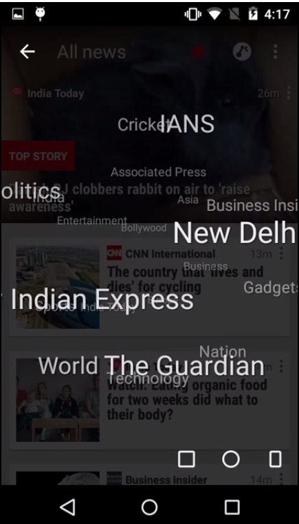
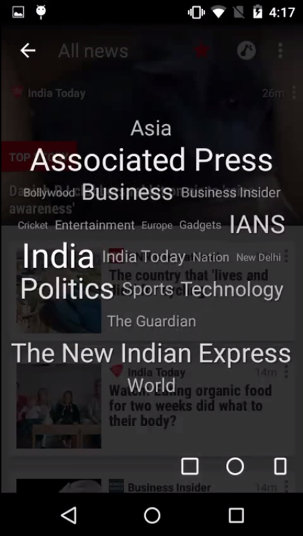
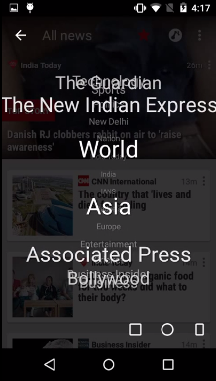

## 问题总结

- ** 原生SQL -> ORM框架的升级问题 **

https://stackoverflow.com/questions/28569599/use-activeandroid-on-existing-database-content
这种问题本身就应该由框架提供功能，能够方便开发者快速的从原先的SQL方式升级到当前的框架
I think this problem should have implemented by ActiveAndroid(不知道有没有语法错误)

- ** 立体(球形、正方体、滚轮)标签云绘制 **

https://stackoverflow.com/questions/30480541/spherical-animation-with-text-for-using-tag-cloud-in-android-app-news-republic

【效果预览】

【视频效果】
[Android Superb (Globe like) Animation for tag cloud by News Republic](https://www.youtube.com/watch?v=ivvEUzRGQkA&feature=youtu.be)

楼主有问到要不要用OpenGL等之类的高级东东，还找出了相关的[资料地址](http://www.programering.com/a/MDM3cjNwATU.html)，自己感觉对OpenGL了解甚少呀，我能想到的就是自己在doDraw里面重绘了，当然能找到不错的第三方库还是不错的，就比如下面的TagCloud

[3D Tag Cloud for Android - Tagin_Demo](https://sites.google.com/site/tagindemo/TagCloud)
[~saranasr83/tagin/TagCloud : files for revision 8](http://bazaar.launchpad.net/~saranasr83/tagin/TagCloud/files)
[Code : tagin! - Bazaar branches](https://code.launchpad.net/tagin)

